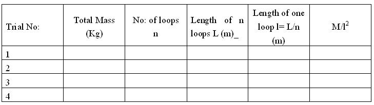

### Procedure

<h2>Performing Simulator</h2>

<h3>Combo Box:</h3>
<ul>
  <li><strong>Longitudinal mode:</strong> In this arrangement the tuning fork is set in such a manner that the vibrations of the prongs are parallel to the length of the string.</li>
  <li><strong>Transverse mode:</strong> In this arrangement the vibration of the prongs of the tuning fork are in the direction perpendicular to the length of the string.</li>
  <li><strong>Selecting Tuning fork:</strong> There are five tuning forks with different frequencies. One can choose any one of the tuning forks to carry out the experiment.</li>
  <li><strong>Select Environment:</strong> This is used to select the environment to carry out the experiment.</li>
</ul>

<h3>Sliders:</h3>
<ul>
  <li><strong>Mass in the pan M'</strong> - This slider is used for adding mass in the scale pan.</li>
  <li><strong>Transformer Voltage</strong> - This is used to change the voltage of the step down transformer. <em>Note: At 8V, we get well defined loops.</em></li>
  <li><strong>Scale Position</strong> - This is used to change the position of the meter scale and one can calculate the length of one loop.</li>
  <li><strong>Power On</strong> - This is used to start the experiment.</li>
  <li><strong>Pointer movement</strong> - The pointer can be moved by using the arrow keys on either side of the zoomed part of the loop image in the simulator.</li>
  <li><strong>Reset</strong> - One can repeat the whole experiment by using this button.</li>
  <li><strong>Show Result</strong> - This helps you to check the result of the experiment with manual calculation.</li>
</ul>

<h2>Procedure for Simulation</h2>
<ol>
  <li>Select the mode of Vibration.</li>
  <li>Select a particular tuning fork to carry out the experiment.</li>
  <li>Choose the environment for doing the experiment.</li>
  <li>The transformer voltage is adjusted to 8V.</li>
  <li>Mass is suspended in the scale pan.</li>
  <li>Power on the button and loops will be formed.</li>
  <li>Length <em>l</em> for one loop is measured by adjusting the scale position.</li>
  <li>Using equations for mode of vibration, calculate the frequency of particular tuning fork.</li>
  <li>Repeat the experiment by changing the parameters.</li>
</ol>

<h2>Procedure for Real Lab</h2>

<h4>Transverse Mode of Vibration of the String</h4>

The apparatus is arranged with the length of the string parallel to the prong of the tuning fork on which one end of the string is attached. The other end of the string carrying a scale pan is passed over a pulley fixed at one end of the table. When the tuning fork is excited, it vibrates perpendicular to the length of the string.

The scale pan is detached from the string and its mass and length is determined using a common balance and meter scale. Hence, linear density is calculated.

The scale pan is again suspended at the end of the string and mass is added in the scale pan. The circuit is closed and tuning fork is set into vibration. The string vibrates transversely producing stationary waves. The length of the string is so adjusted to get well-defined loops. Keeping two long knitting needles at two nodes, length of <em>N</em> loops is measured and average length is calculated. Using equations, frequency of the tuning fork is calculated.

<h4>Longitudinal Mode of Vibration of the String</h4>

The apparatus is arranged with length of the string perpendicular to the prong of the fork. In this case, when the tuning fork is vibrated, it moves parallel to the length of the string. The experiment is performed exactly as in the previous case.

## Observations and Calculations

Here, M is the total mass- mass of the scale pan + mass suspended.

Mass of the scale pan - 0 .5g.

#### Transverse mode

$f=\sqrt{\frac{gM}{4\mu l^2}} = .................. \text{Hz}$

<strong>f</strong> - Frequency of tuning fork in Hz

<strong>&mu;</strong> - Linear density in kg/m &nbsp; &nbsp; 
= mass of the string / length of the string.

Here, 
Mass = 350&nbsp;mg 
Length = 3&nbsp;m 
&mu; = 1.17 &times; 10-4&nbsp;kg/m

<strong>l</strong> - Length of one loop in m

#### Longitudinal mode

$f=\sqrt{\frac{gM}{\mu l^2}} = .................. \text{Hz}$

<h2>Results</h2>

<ol>
  <li>The frequency of electrically maintained tuning fork at <strong>longitudinal</strong> mode of vibration = ....................... Hz</li>
  <li>The frequency of electrically maintained tuning fork at <strong>transverse</strong> mode of vibration = ....................... Hz</li>
</ol>

