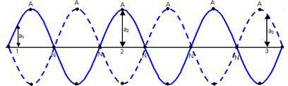

### Theory 

Speed of waves in a stretched string: A string means a wire or a fiber which has a uniform diameter and is perfectly flexible. The speed of a wave in a flexible stretched string depends upon the tension in the string and mass per unit length of the string.

$$v=\sqrt{\frac{T}{\mu}}............(1)$$

Where the tension T in the string equal to Mg. 
M - Mass suspended and g is acceleration due to gravity. 

μ -  linear density or mass per unit length of the string.

$$\mu=\frac{m}{L}..........(2)$$

Where m is the mass of the string and L is the total length of the string.

Vibrations of a stretched string: When the wire is clamped to a rigid support, the transverse progressive waves travel towards each end of the wire. By the superposition of incident and reflected waves, transverse stationary waves are set up in the wire. Since ends of the wire are clamped, there is node N at each end and anti node A in the middle  as shown in Fig: 1.

Figure 1: Schematic representation of stationary wave

The points of the medium which have no displacements called nodes and there are some points which vibrate with maximum amplitude called antinodes.

The distance between two consecutive nodes is λ/2, ( λ - wavelength). Because l is half a wavelength in the equations,

$$l=\frac{\lambda}{2}..........(3)$$

If ‘f’ be the frequency of vibration the wire,

