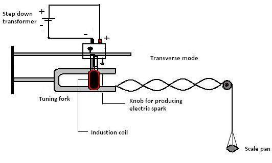
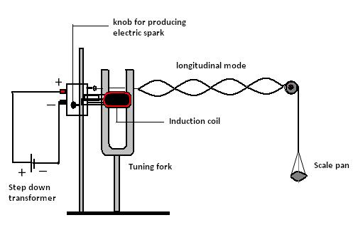

### Theory 

Speed of waves in a stretched string: A string means a wire or a fiber which has a uniform diameter and is perfectly flexible. The speed of a wave in a flexible stretched string depends upon the tension in the string and mass per unit length of the string.

$$v=\sqrt{\frac{T}{\mu}}............(1)$$

Where the tension T in the string equal to Mg. 
M - Mass suspended and g is acceleration due to gravity. 

μ -  linear density or mass per unit length of the string.

$$\mu=\frac{m}{L}..........(2)$$

Where m is the mass of the string and L is the total length of the string.

**Vibrations of a stretched string**: When the wire is clamped to a rigid support, the transverse progressive waves travel towards each end of the wire. By the superposition of incident and reflected waves, transverse stationary waves are set up in the wire. Since ends of the wire are clamped, there is node N at each end and anti node A in the middle  as shown in Fig: 1.

Figure 1: Schematic representation of stationary wave

The points of the medium which have no displacements called nodes and there are some points which vibrate with maximum amplitude called **antinodes**.

The distance between two consecutive nodes is λ/2, ( λ - wavelength). Because l is half a wavelength in the equations,

$$l=\frac{\lambda}{2}..........(3)$$

If ‘f’ be the frequency of vibration the wire,

$$f=\frac{v}{\lambda}=\frac{v}{2l}...........(4)$$

Substituting the value of ' v ' in equation (4)

$$f=\frac{1}{2l}\sqrt{\frac{T}{\mu}}............(5)$$

**Transverse drive mode** : In this arrangement the vibrations of the prongs of the tuning fork are in the direction perpendicular to the length of the string.

The time, during which the tuning fork completes one vibration, the string also completes one vibration. In this mode, frequency of the string is equal to the frequency of the tuning fork.

 

Therefore from equation (5),

$$\text{Frequency }f=\sqrt{\frac{gM}{4\mu l^2}}..................(6)$$

Where

The total mass M is equal to the mass M' of the weight in the scale pan plus the mass $M_0$ of the scale pane, $M = M' + M_0$.

 

 

**Longitudinal drive mode**: In this arrangement the tuning fork is set in such a manner that the vibrations of the prongs are parallel to the length of the string.

The time, during which the tuning fork completes one vibration, the string completes half of its vibration. In this mode, frequency of the fork is twice the frequency of the string.

 $$\text{Frequency }f=\sqrt{\frac{gM}{\mu l^2}}..................(7)$$

 Using equation (6) and (7) we can calculate the frequency of electrically maintained tuning fork in two different modes of vibration.

In transverse drive mode the string follows the motion of the tuning fork, up and down, once up and once down per cycle of tuning fork vibration.

However, one cycle of up and down vibration for transverse waves on the string is two cycles of string tension increase and decrease. The tension is maximum both at the loops’ maximum up position and again at maximum down position. Therefore, in longitudinal drive mode, since the string tension increases and decreases once per tuning fork vibration, it takes one tuning fork vibration to move the string loop to maximum up position and one to move it to maximum down position. This is two tuning fork vibrations for one up and down string vibration, so the tuning fork frequency is half the string frequency.
 

 

#### Applications

1. Tuning of instruments like guitar.
2. Standing waves in air coloumn, soprano saxophone etc.
3. Human speech analysis.
